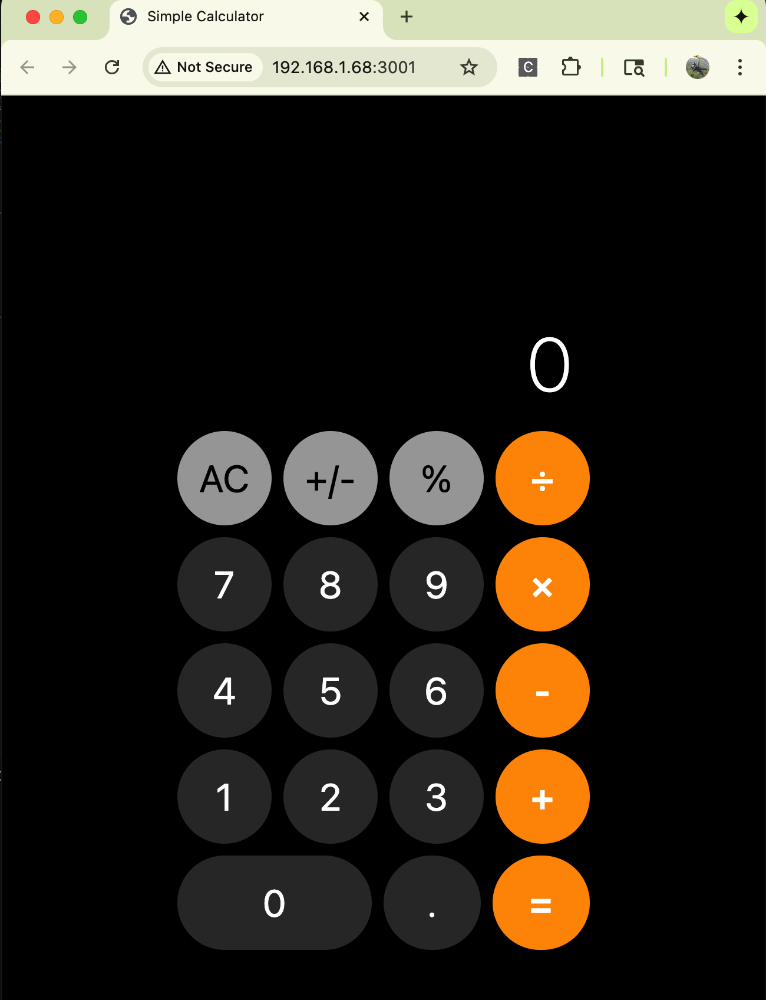

# Simple Calculator

A beautiful calculator app built with React Native and TypeScript, inspired by the macOS calculator design.

<!--  -->


## Features

- ✨ Clean, modern design inspired by macOS calculator
- 🧮 Basic arithmetic operations (+, -, ×, ÷)
- 🔢 Support for decimal numbers
- 🔄 Plus/minus toggle
- 📊 Percentage calculations
- 🧹 Clear (AC) functionality
- 📱 Responsive design that works on web, iOS, and macOS

## Technology Stack

- **React Native** - Cross-platform mobile development framework
- **TypeScript** - Type-safe JavaScript for better development experience
- **React Native Web** - Run React Native components in web browsers
- **Webpack** - Module bundler for web deployment

## Getting Started

### Prerequisites

- Node.js (version 14 or higher)
- npm or yarn package manager

### Installation

1. Clone the repository:
   ```bash
   git clone <your-repo-url>
   cd SimpleCalculator
   ```

2. Install dependencies:
   ```bash
   npm install
   ```

### Running the App

#### Web Version (Easiest to test)
```bash
npm run web
```
This will start a development server and open the calculator in your web browser at `http://localhost:3000`.

#### iOS Version
```bash
npm run ios
```
This will start the iOS simulator with the calculator app.

#### macOS Version
```bash
npm run macos
```
This will build and run the native macOS app.

## Project Structure

```
SimpleCalculator/
├── src/
│   ├── App.tsx                 # Main app component
│   └── components/
│       ├── Calculator.tsx      # Main calculator logic and UI
│       └── CalculatorButton.tsx # Individual button component
├── public/
│   └── index.html             # HTML template for web version
├── index.js                   # React Native entry point
├── index.web.js              # Web-specific entry point
├── package.json              # Dependencies and scripts
├── tsconfig.json            # TypeScript configuration
├── babel.config.js          # Babel configuration
├── webpack.config.js        # Webpack configuration for web
└── README.md               # This file
```

## How It Works (TypeScript Concepts Explained)

Since you're new to TypeScript, here are the key concepts used in this project:

### 1. **Components and Props**
```typescript
interface CalculatorButtonProps {
  title: string;           // The text on the button
  onPress: () => void;     // Function that runs when pressed
  type: 'number' | 'operator' | 'function'; // Button type
  isWide?: boolean;        // Optional: is the button wide?
}
```
This is called an **interface**. It's like a contract that tells TypeScript exactly what data a component expects to receive.

### 2. **State Management with Hooks**
```typescript
const [display, setDisplay] = useState('0');
const [operation, setOperation] = useState<string | null>(null);
```
**useState** is a React "hook" that lets components remember information. The `<string | null>` part tells TypeScript that the operation can be either a string or null.

### 3. **Function Types**
```typescript
const handleNumberPress = (num: string) => {
  // Function logic here
};
```
This tells TypeScript that `handleNumberPress` is a function that takes a string parameter called `num`.

### 4. **Event Handling**
```typescript
onPress={() => handleNumberPress('7')}
```
This creates a function that, when called, will run `handleNumberPress` with the value '7'.

## Calculator Logic

The calculator uses a simple state machine approach:

1. **Display State**: Shows the current number or result
2. **Previous Value**: Stores the first number in an operation
3. **Operation**: Stores what operation to perform (+, -, ×, ÷)
4. **Waiting for New Value**: Tracks whether we're ready for a new number

### Example Calculation Flow:
1. User presses "5" → Display shows "5"
2. User presses "+" → Previous value = 5, Operation = "+", Waiting = true
3. User presses "3" → Display shows "3", Waiting = false
4. User presses "=" → Calculate 5 + 3 = 8, Display shows "8"

## Styling

The app uses React Native's `StyleSheet` API, which is similar to CSS but optimized for mobile apps:

```typescript
const styles = StyleSheet.create({
  button: {
    flex: 1,              // Takes available space
    height: 80,           // Fixed height in pixels
    borderRadius: 40,     // Rounded corners
    backgroundColor: '#333333', // Dark gray color
  },
});
```

## Contributing

Feel free to submit issues and enhancement requests!

## License

This project is licensed under the MIT License - see the LICENSE file for details.

## Learning Resources

If you want to learn more about the technologies used:

- [React Native Documentation](https://reactnative.dev/docs/getting-started)
- [TypeScript Handbook](https://www.typescriptlang.org/docs/)
- [React Hooks Guide](https://reactjs.org/docs/hooks-intro.html)
- [React Native Web](https://necolas.github.io/react-native-web/)